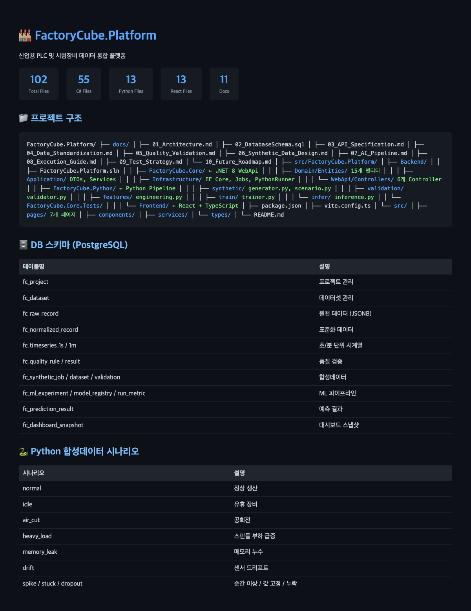

<div align="center">

# 🏭 FactoryCube.Platform

**산업용 PLC 및 시험장비 데이터 통합 플랫폼**

합성데이터 생성 → 품질 검증 → AI 분석 → 운영 대시보드

[](https://dotnet.microsoft.com/)
[](https://react.dev/)
[](https://www.typescriptlang.org/)
[](https://www.python.org/)
[](https://www.postgresql.org/)

</div>

---

## 📸 프로젝트 구조



## 📊 통계

| 구분 | 파일 수 | 설명 |
|------|---------|------|
| C# 백엔드 | 55 | .NET 8 WebApi, Domain/Application/Infrastructure |
| Python 파이프라인 | 13 | 합성데이터, 검증, Feature Engineering, 학습, 추론 |
| React 프론트엔드 | 13 | TypeScript, Vite, MUI, Recharts |
| 문서 | 11 | 아키텍처, DB 스키마, API 명세, 설계 문서 |
| **합계** | **102** | |

## 🏗️ 시스템 아키텍처

```
┌─────────────────────────────────────────────────────────────┐
│  React + TypeScript (Dashboard, Data Explorer, AI Experiment) │
└─────────────────────────────────────────────────────────────┘
                              │ REST API
┌─────────────────────────────────────────────────────────────┐
│  WebApi (.NET 8) → Services → Repositories → EF Core → PostgreSQL │
│  BackgroundService (File Watcher, Job Queue, Python Runner)   │
└─────────────────────────────────────────────────────────────┘
                              │
┌─────────────────────────────────────────────────────────────┐
│  Python Pipeline (synthetic / validation / features / train / infer) │
│  CLI 기반 Job 실행: config.json + input.csv → output.csv     │
└─────────────────────────────────────────────────────────────┘
```

## 🗄️ DB 스키마 (PostgreSQL)

`fc_` 접두어를 사용하는 20개 테이블:

| 테이블 | 설명 |
|--------|------|
| `fc_project` | 프로젝트 관리 |
| `fc_dataset` / `fc_dataset_file` | 데이터셋 및 원천 파일 |
| `fc_raw_record` / `fc_normalized_record` | 원천/표준화 데이터 |
| `fc_timeseries_1s` / `fc_timeseries_1m` | 초/분 단위 시계열 |
| `fc_quality_rule` / `fc_quality_result` | 품질 검증 |
| `fc_synthetic_job` / `fc_synthetic_dataset` / `fc_synthetic_validation` | 합성데이터 |
| `fc_ml_experiment` / `fc_ml_model_registry` / `fc_ml_run_metric` | ML 파이프라인 |
| `fc_prediction_result` | 예측 결과 |
| `fc_dashboard_snapshot` | 대시보드 스냅샷 |

> 📄 전체 스키마: [`docs/02_DatabaseSchema.sql`](docs/02_DatabaseSchema.sql)

## 🚀 핵심 기능

### 1. 데이터 수집/적재
- CSV, JSON, XLSX 업로드
- 폼더 감시 자동 적재
- 원천 파일 버전 관리 (checksum)
- 스키마 자동 감지

### 2. 데이터 표준화/가공
- **PLC 데이터**: FANUC 계열 89개 항목 → 표준 태그 매핑
- **시험장비 공통데이터**: process_cpu_percent → `proc_cpu_pct`, memory_percent → `host_mem_pct` 등
- **시험장비 측정데이터**: 압력 → `pressure`, 온도 → `temperature`, Text_16 → `custom_text_16` 등
- 파생 필드: `is_air_cut_candidate`, `process_health_score`, `cycle_time_delta`, `drift_score`, `anomaly_score_rule_based`
- 상태 판정: OFF → READY → RUNNING → IDLE → HANG → ALARM → ERROR → MAINTENANCE

### 3. 데이터 품질 검증
- **스키마 검증**: 필수 컬럼, 타입 불일치, 중복 컬럼
- **값 검증**: null 비율, 음수값, 범위 초과, timestamp 역전
- **시계열 검증**: 간격 누락, 중복 시각, 평평한 값 지속, spike, 카운터 감소
- **도메인 검증**: 공회전 후보, part_counter 감소, PowerOnTime 역행, 온도 범위 초과
- **검증 결과**: row-level / batch-level / dataset-level, 품질 점수(0~100), PASS/WARNING/REJECT

### 4. 합성데이터 생성기 ⭐
- **생성 방식**: 룰 기반, 통계 기반, 시계열 패턴 재조합, 상태 전이 기반, 잡음 주입, 이상 시나리오 주입
- **지원 시나리오**: 정상 생산, 유휴, 공회전, 점진적 부하 증가, 스핀들 부하 급증, cycle time 증가, alarm 발생, hung, 재시작 반복, 센서 드리프트, 순간 spike, 값 고정(stuck), 결측 구간, 네트워크 지연
- **생성 옵션**: 장비 수, 기간, 상태 비율, 이상 비율, seed, noise_level, drift_level
- **라벨**: state_label, anomaly_label, scenario_label, failure_risk_level, health_grade

### 5. 합성데이터 검증
- 원본 vs 합성 데이터 분포 비교 (평균/분산/왜도/첨도)
- 상관관계 비교, 상태 비율 비교, 이벤트 빈도 비교
- autocorrelation, rolling mean/std 비교
- 도메인 룰 위배 건수 비교

### 6. AI/ML 분석
- **과제**: 장비 상태 분류, 가동/비가동 판정, 이상 탐지, 알람 예측, cycle time 예측, spindle load 예측, maintenance priority score, health score
- **모델 카탈로그**:
  - 분류: XGBoost, LightGBM, RandomForest, LogisticRegression
  - 이상탐지: IsolationForest, OneClassSVM
  - 시계열: ARIMA + Gradient Boosting, LSTM/GRU (옵션)
- **평가 지표**: accuracy, precision, recall, f1, roc_auc, mae, rmse, mape, r2, precision@k, recall@k, pr_auc
- **Explainability**: feature importance, permutation importance, SHAP (2차 고도화)

### 7. 운영 대시보드
- 장비 가동률, RUNNING/IDLE/HANG 비율
- 알람 추이, cycle time 추이
- health score 랭킹, maintenance 추천 리스트
- Recharts 기반 시계열 차트, Pie 차트, KPI 카드

## 📁 프로젝트 구조 상세

```
src/FactoryCube.Platform/
├── Backend/
│   ├── FactoryCube.Core/              ← .NET 8 WebApi
│   │   ├── Domain/Entities/           ← 15개 엔티티 (Project, Dataset, QualityRule, SyntheticJob, MlExperiment 등)
│   │   ├── Application/
│   │   │   ├── DTOs/                  ← Request/Response DTOs
│   │   │   ├── Interfaces/            ← Service contracts
│   │   │   └── Services/              ← Business logic (ProjectService, DatasetService, SyntheticService, MlService, QualityService, DashboardService)
│   │   ├── Infrastructure/
│   │   │   ├── Data/                  ← EF Core DbContext, Repositories
│   │   │   ├── Jobs/                  ← BackgroundService (SyntheticJobBackgroundService)
│   │   │   └── PythonRunner/          ← C# ↔ Python Process 연동
│   │   └── WebApi/Controllers/        ← 6개 REST API Controller
│   ├── FactoryCube.Python/            ← Python Pipeline
│   │   ├── synthetic/
│   │   │   ├── generator.py           ← 핵심 생성기 (Signal Generator + Noise/Anomaly Injector + Label Generator)
│   │   │   └── scenario.py            ← Scenario Library + State Transition Engine
│   │   ├── validation/validator.py    ← 원본-합성 분포/도메인 검증
│   │   ├── features/engineering.py    ← Lag/Rolling/파생 Feature
│   │   ├── train/trainer.py           ← XGBoost/RF/IsolationForest 학습
│   │   └── infer/inference.py         ← 모델 추론 엔진
│   └── FactoryCube.Core.Tests/        ← xUnit + Moq 단위 테스트
│
└── Frontend/                          ← React + TypeScript
    ├── src/pages/                     ← 7개 화면 (ProjectList, ProjectDetail, Dataset, Synthetic, Quality, Ml, Dashboard)
    ├── src/components/Layout.tsx      ← MUI Drawer + AppBar
    ├── src/services/api.ts            ← Axios API client
    └── src/types/index.ts             ← TypeScript 타입 정의
```

## ⚡ 빠른 시작

### 1. 필수 조건
- .NET 8 SDK
- PostgreSQL 15+
- Node.js 18+
- Python 3.11

### 2. DB 설정
```bash
psql -U postgres -c "CREATE DATABASE factorycube;"
psql -U postgres -d factorycube -f docs/02_DatabaseSchema.sql
```

### 3. 백엔드 실행
```bash
cd src/FactoryCube.Platform/Backend/FactoryCube.Core
dotnet restore
dotnet run
# http://localhost:5000
# Swagger: http://localhost:5000/swagger
```

### 4. 프론트엔드 실행
```bash
cd src/FactoryCube.Platform/Frontend
npm install
npm run dev
# http://localhost:3000
```

### 5. Python 환경
```bash
cd src/FactoryCube.Platform/Backend/FactoryCube.Python
pip install -r requirements.txt
python main.py --job-type synthetic --config config.json --output ./output
```

## 📡 API 명세

| 엔드포인트 | 설명 |
|-----------|------|
| `GET /api/projects` | 프로젝트 목록 |
| `POST /api/projects` | 프로젝트 생성 |
| `GET /api/datasets?projectId={id}` | 데이터셋 목록 |
| `POST /api/datasets/{id}/upload` | 파일 업로드 |
| `POST /api/datasets/{id}/ingest` | 원천 데이터 적재 |
| `POST /api/synthetic/jobs` | 합성데이터 Job 생성 |
| `GET /api/synthetic/projects/{id}/jobs` | Job 목록 |
| `POST /api/quality/datasets/{id}/check` | 품질 검증 실행 |
| `POST /api/ml/experiments` | ML 실험 생성 |
| `POST /api/ml/experiments/{id}/train` | 학습 시작 |
| `GET /api/dashboard/projects/{id}/snapshot` | 대시보드 스냅샷 |

> 📄 상세 API 명세: [`docs/03_API_Specification.md`](docs/03_API_Specification.md)

## 📚 문서 목록

| 문서 | 내용 |
|------|------|
| [`01_Architecture.md`](docs/01_Architecture.md) | 전체 아키텍처, 배치/Job 흐름, C#↔Python 연동 |
| [`02_DatabaseSchema.sql`](docs/02_DatabaseSchema.sql) | PostgreSQL DDL, 인덱스, 제약조건, JSONB 컬럼 |
| [`03_API_Specification.md`](docs/03_API_Specification.md) | REST API 상세 명세 (요청/응답) |
| [`04_Data_Standardization.md`](docs/04_Data_Standardization.md) | PLC/시험장비 원천→표준 필드 매핑, 파생 필드, 상태 판정 로직 |
| [`05_Quality_Validation.md`](docs/05_Quality_Validation.md) | 4단계 품질 검증 설계, 품질 점수 산출식 |
| [`06_Synthetic_Data_Design.md`](docs/06_Synthetic_Data_Design.md) | 생성 아키텍처, 상태 전이, 신호 생성 규칙, 이상 주입, 라벨 |
| [`07_AI_Pipeline.md`](docs/07_AI_Pipeline.md) | 학습/추론 파이프라인, 모델 카탈로그, 평가 지표, Explainability |
| [`08_Execution_Guide.md`](docs/08_Execution_Guide.md) | 사전 요구사항, 실행 순서, CLI 사용법 |
| [`09_Test_Strategy.md`](docs/09_Test_Strategy.md) | 단위/통합/Python/E2E/성능/품질 검증 테스트 |
| [`10_Future_Roadmap.md`](docs/10_Future_Roadmap.md) | MVP → 2차 고도화 → 3차 아키텍처 확장 |
| [`00_Project_Structure.md`](docs/00_Project_Structure.md) | 폼더 구조 상세 트리 |

## 🧪 테스트

```bash
# C# 단위 테스트
cd src/FactoryCube.Platform/Backend/FactoryCube.Core.Tests
dotnet test

# Python 테스트
cd src/FactoryCube.Platform/Backend/FactoryCube.Python
pytest tests/ -v
```

## 🗺️ 향후 확장

### 2차 고도화
- HMM/Markov Chain 기반 상태 전이 고도화
- LSTM Autoencoder 고급 이상탐지
- Optuna AutoML 보조
- SHAP Explainability
- Quartz.NET 스케줄링

### 3차 아키텍처
- 마이크로서비스 분리 (Ingestion, Synthetic, ML, Dashboard)
- RabbitMQ/Kafka 메시지 큐
- InfluxDB/TimescaleDB 시계열 DB
- SignalR 실시간 스트리밍
- Docker + Kubernetes
- gRPC C#↔Python 연동

## 📄 라이선스

Proprietary - 낸부 제품 개발용
